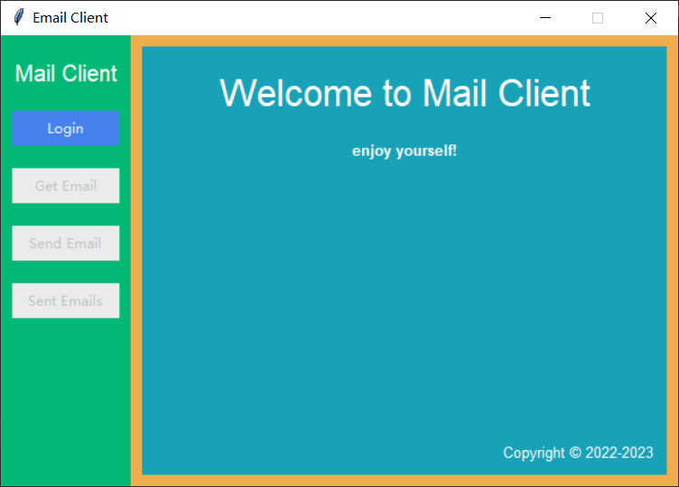
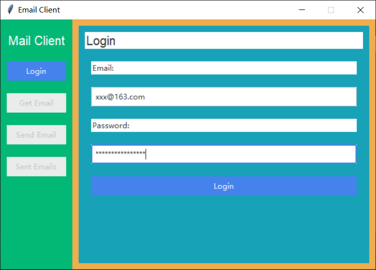
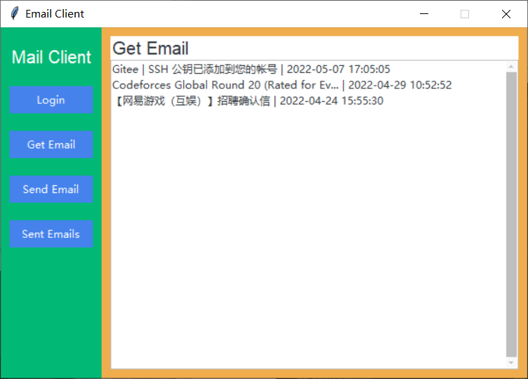
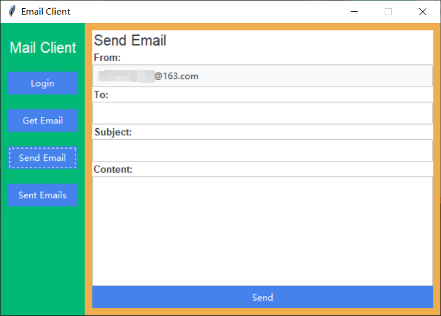
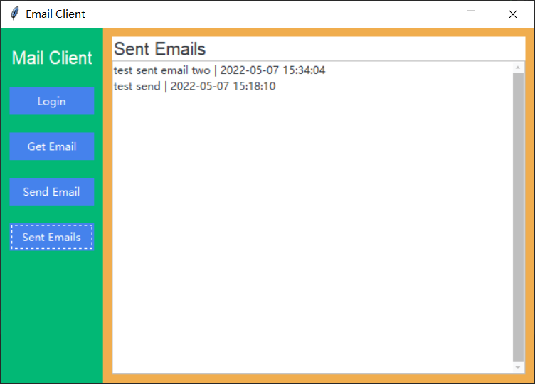

# Python e-mail client

python大作业，使用pop3协议接收邮件，smtp协议发送邮件。

界面由tkinter构建，使用ttkbootstrap样式。

## 预览

欢迎界面



登录界面



收信界面



发送邮件界面



发件箱界面



## 安装

将源代码克隆到本地，运行下面的命令安装依赖：

```shell
pip install -r requirements.txt
```

输入下面的命令启动程序：

```shell
python ./src/main.py
```